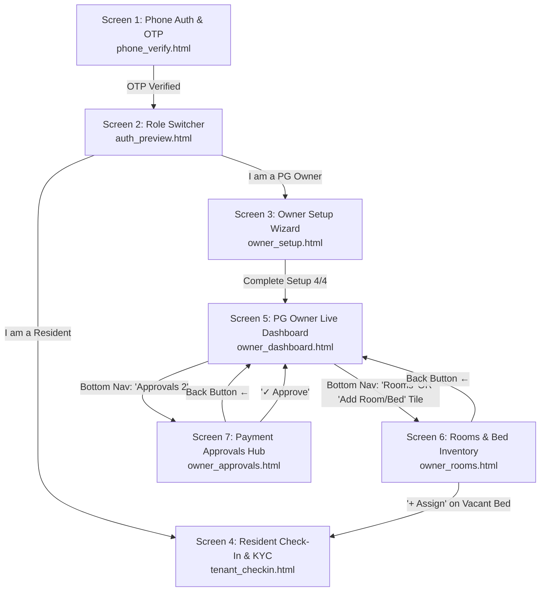

# UrbanStay — Master Knowledge Base (KBS — 18th August 2026)

---

## 🏛️ Executive Product & Company Profile

* **Company & Brand**: **UrbanStay** (`urbanstay.living`, MSME Registered, Class 9 Trademark Application #7920292).
* **Founder**: Bhargav S Kulkarni (Bengaluru native, Dayananda Sagar DBIT Bengaluru graduate, working on Monetization & Revenue at NoBrokerHood).
* **Pilot Anchor Partner**: Arun (Owns 3 PGs in Bangalore + network of 40–50 local PG owners in BTM Layout & Koramangala).
* **Core Product Identity**: A **Dedicated PG Operations & Resident Management Platform** (NOT an aggregator/broker like OYO/Zolo).
* **Core Value Proposition**:
  * **0% Transaction Fee Direct Bank Settlement**: Rent goes 100% directly from tenant's UPI app (GPay/PhonePe) into the owner's personal bank account in 3 seconds (₹0 cut).
  * **60-Second Frictionless Check-In**: Walk-in techies scan reception QR, auto-allocate room/bed, and get instant Digital Room Pass (zero police intimidation, zero forced online payment).
  * **Automated WhatsApp Reminders & Stamped PDF Receipts**: 1-Tap reminder dispatch and auto-generated HRA-compliant rent receipts.

---

# 🗺️ Master End-to-End Navigation & Screen Map

Every button, click, and transition in UrbanStay connects together seamlessly:



---

# 📱 Complete Screen-by-Screen Click Matrix & File Index

### 1. `ProductionCode/phone_verify.html` (Screen 1: Phone Auth & Skyline)
* **What it does**: Clean phone number input with India flag `+91`, 6-digit OTP auto-filler, and Bengaluru cityscape artwork.
* **On `[ Continue ]` Click**: Navigates directly to `auth_preview.html`.
* **Live URL**: `http://10.99.9.51:8080/ProductionCode/phone_verify.html`

---

### 2. `ProductionCode/auth_preview.html` (Screen 2: Role Switcher)
* **What it does**: Allows user to select their role.
* **Clicks**:
  * Tap `[ I am a PG Owner ]` $\rightarrow$ Navigates to `owner_setup.html` (or `owner_dashboard.html`).
  * Tap `[ I am a Resident / Tenant ]` $\rightarrow$ Navigates to `tenant_checkin.html`.
* **Live URL**: `http://10.99.9.51:8080/ProductionCode/auth_preview.html`

---

### 3. `ProductionCode/owner_setup.html` (Screen 3: Owner 4-Step Setup Wizard)
* **What it does**:
  * **Step 1**: Owner Full Name & KYC.
  * **Step 2**: PG Property Name, Koramangala Address, Verified 6-digit Pincode (`560034`).
  * **Step 3**: Ground Floor toggle, Floor count, Room count, Room numbering format (`101` vs `G-01`), Sharing pricing matrix (`1-Share` to `6-Share`), and Security deposit rules.
  * **Step 4**: Primary Bank UPI ID (`arunpg@okhdfcbank`), Account Holder Name, Bank Name (`HDFC Bank`) for **0% Direct Bank Settlement**.
* **On `[ Complete Setup ]` Click**: Navigates directly to `owner_dashboard.html`.
* **Live URL**: `http://10.99.9.51:8080/ProductionCode/owner_setup.html`

---

### 4. `ProductionCode/tenant_checkin.html` (Screen 4: Resident Check-In & KYC)
* **What it does**:
  * **Step 1**: Legal Full Name, Phone, Aadhaar Number, Photo Upload.
  * **Step 2**: Company / College Name, Native City, Emergency Guardian Contact.
  * **Step 3**: Dynamic Floor selection (`Ground`, `1st`, `2nd`...) $\rightarrow$ Dynamic Room selector (`G-01..04`, `101..104`) + `+ Custom` fallback $\rightarrow$ Bed selection (`Bed A`, `Bed B`).
  * **Output**: Instant Digital Room Pass & Stamped IT Act 2000 Stay Agreement PDF.
* **Live URL**: `http://10.99.9.51:8080/ProductionCode/tenant_checkin.html`

---

### 5. `ProductionCode/owner_dashboard.html` (Screen 5: PG Owner Live Command Center)
* **What it does**:
  * **Header**: `UrbanStay Owner Dashboard`, PG verified checkmark, WhatsApp support button, Notification bell with `3` badge.
  * **Greeting**: `Hello, Arun!` (Zero emojis).
  * **Property Hero Card**: `Greenview PG` • `Koramangala, Bengaluru` • 2x2 Occupancy Matrix (`35 Total Beds`, `31 Occupied (88%)`, `4 Vacant`, `0 Under Maint`).
  * **Monthly Financial Overview**: `May 2024 ▾`, `₹2,12,000 Rent Collected`, `₹68,400 Total Expenses`, `₹1,43,600 Net Profit`.
  * **8-Tile Quick Actions Grid**:
    1. `Rent Collection` $\rightarrow$ Opens Defaulters Modal & WhatsApp trigger.
    2. `Add Expense` $\rightarrow$ Opens Expense Logger.
    3. `Add Room / Bed` $\rightarrow$ Navigates to `owner_rooms.html`.
    4. `Notice Periods` $\rightarrow$ Opens Move-out Vacancy flyer modal.
    5. `Complaints` $\rightarrow$ Opens Maintenance ticket modal.
    6. `Police Verification` $\rightarrow$ Opens BCP Police Verification ZIP export.
    7. `Staff Management` $\rightarrow$ Opens Warden permissions & Mess headcount.
    8. `Reports` $\rightarrow$ Generates business report.
  * **Bottom Navigation Bar**:
    * `Dashboard` (Active Home).
    * `Rooms` $\rightarrow$ Navigates to `owner_rooms.html`.
    * `Approvals (2)` $\rightarrow$ Navigates to `owner_approvals.html`.
    * `Finance` $\rightarrow$ Opens Expense logger.
    * `More` $\rightarrow$ Opens Staff/Settings.
* **Live URL**: `http://10.99.9.51:8080/ProductionCode/owner_dashboard.html`

---

### 6. `ProductionCode/owner_rooms.html` (Screen 6: Rooms & Bed Management)
* **What it does**:
  * **Top Bar**: Back button `←` (returns to `owner_dashboard.html`) + `[ + Add Room ]` button (opens modal).
  * **Floor Selector Dropdown**: Clean dropdown selector (`🏢 All Floors (35 Beds)` | `Ground Floor` | `1st Floor` | `2nd Floor` | `3rd Floor` | `4th Floor`).
  * **Room Cards**:
    * `Room 101` (2-Sharing • ₹8,500/bed • Deposit: ₹15,000 • `[ Attached Bath ] [ Balcony ]`).
    * `[ Edit Room ]` button $\rightarrow$ Opens modal to rename room, change sharing, edit rent/deposit, or mark *Under Maintenance*.
  * **Individual Bed Rows**:
    * **Bed A (Rahul Sharma - Paid)** $\rightarrow$ `[ Edit ]` (Edit resident profile) • `[ KYC ]` (Aadhaar viewer) • `[ Shift ]` (Bed swap modal).
    * **Bed B (Amit Verma - Overdue)** $\rightarrow$ `[ Edit ]` • `[ WhatsApp ]` (Direct UPI ping).
    * **Bed B Vacant** $\rightarrow$ `[ + Assign ]` (Opens `tenant_checkin.html`) • `[ Flyer ]` (WhatsApp flyer).
    * **Bed C Notice (Praveen M)** $\rightarrow$ `[ Edit ]` • `[ Exit Settlement ]` (Deposit refund calculator).
  * **Sub-Meter EB Billing**: `[ ⚡ Sub-Meter EB ]` button $\rightarrow$ Auto-splits units consumed per active bed.
* **Live URL**: `http://10.99.9.51:8080/ProductionCode/owner_rooms.html`

---

### 7. `ProductionCode/owner_approvals.html` (Screen 7: Full-Page Payment Approvals Hub)
* **What it does**:
  * **Top Bar**: Back button `←` (returns to `owner_dashboard.html`) + `2 Pending` counter badge.
  * **Dual Filter Dropdowns**:
    * `[ 🏢 Select Floor: All | Ground | 1st | 2nd | 3rd ]`
    * `[ 🚪 Select Room: All | Room 101 | Room 102 | Room 201 | Room G-01 ]`
  * **Approval Cards**:
    * **Rahul Sharma**: `1st Floor • Room 101 (Bed A)` • **`2-Sharing`** • `₹8,500` • UTR `4231 8976 5412` • `[ View Proof ]` (Opens full screenshot preview modal) • `[ ✓ Approve & Send Receipt ]` • `[ ✕ Reject ]`.
    * **Amit Verma**: `1st Floor • Room 101 (Bed B)` • **`2-Sharing`** • `₹8,500` • UTR `8891 2345 0912` • `[ View Proof ]` • `[ ✓ Approve & Send Receipt ]` • `[ ✕ Reject ]`.
  * **Approval Action**:
    * Tapping `Approve` removes card smoothly, decrements pending counter, updates revenue, and auto-dispatches stamped PDF receipt to the resident's WhatsApp.
* **Live URL**: `http://10.99.9.51:8080/ProductionCode/owner_approvals.html`

---

# 🎨 Strict Design System Tokens (100% Consistent Across All Files)

| Token | Hex / Value | Usage |
| :--- | :--- | :--- |
| **`--green`** | `#08A63F` | Primary brand accents, checkmarks, collection amounts |
| **`--green-dark`** | `#068237` | Text on light green badges, active tab titles |
| **`--green-light`**| `#EBF8EE` | Badge backgrounds, verified icons, avatar backgrounds |
| **`--ink`** | `#111111` | Deep primary typography, primary action buttons |
| **`--muted`** | `#6B7280` | Subtitles, secondary metadata, regular weight labels |
| **`--border`** | `#E5E7EB` | Subtle card borders, input borders |
| **`--card-bg`** | `#FAFAFA` | Inner item containers, proof boxes |
| **`--font`** | `'Outfit', sans-serif`| Clean Google Font (`400` body, `700/800` numbers/headers) |
| **`--max-w`** | `420px - 440px` | Locked mobile viewport with centered container |

---

# 💰 Unit Economics & Monetization Master Table

| Resident Scale | Monthly Subscription | Variable API Cost (WhatsApp + SMS) | Net Profit / PG | Gross Margin |
| :--- | :--- | :--- | :--- | :--- |
| **35 Beds (Arun's PG)** | **₹899 / mo** | ~₹29.75 / mo (35 × ₹0.85) | **₹869.25 / mo** | **96.7%** |
| **100 Beds (3 PGs Network)**| **₹1,999 / mo** | ~₹85.00 / mo | **₹1,914.00 / mo**| **95.7%** |
| **500 Beds (15 PGs Pilot)** | **₹9,999 / mo** | ~₹425.00 / mo | **₹9,574.00 / mo**| **95.8%** |

---

# 🛡️ 0% Direct Settlement Architecture

```
[ Resident GPay / PhonePe ] 
          ↓ (Direct P2P UPI Transfer)
[ Arun's Personal HDFC Bank Account ] (₹0 Transaction Fee)
          ↓ (Tenant submits UTR & Screenshot)
[ Owner Approvals Hub (owner_approvals.html) ]
          ↓ (Arun taps "Approve" in 1 second)
[ Stamped PDF Rent Receipt Auto-Dispatched to Tenant WhatsApp ]
```
