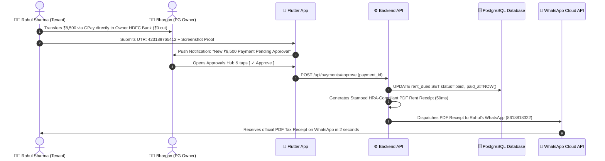

# UrbanStay — Master Knowledge Base (KBS — 23rd August 2026)

---

## 🏛️ Executive Product & Full-Stack Architectural Profile

* **Company & Brand**: **UrbanStay** (`urbanstay.living`, MSME Registered, Class 9 Trademark Application #7920292).
* **Founder**: Bhargav S Kulkarni (Bengaluru native, Dayananda Sagar DBIT Bengaluru graduate, working on Monetization & Revenue at NoBrokerHood).
* **Pilot Anchor Partner**: Arun (Owns 3 PGs in Bangalore + network of 40–50 local PG owners in BTM Layout & Koramangala).
* **Core Product Identity**: A **Dedicated PG Operations & Resident Management Platform** (NOT an aggregator/broker like OYO/Zolo).
* **Primary Tech Stack Decision**:
  * **Frontend (Mobile App)**: **Flutter (Dart + Impeller GPU Engine)** for 60/120fps lag-free operations and instant offline PDF generation.
  * **Backend (API & Webhooks)**: **Node.js (Fastify / Express)** for WhatsApp Cloud API & Razorpay webhook processing.
  * **Database**: **PostgreSQL (Supabase)** with connection pooling and Row Level Security (RLS).
  * **Web Portal**: Lightweight HTML5/JS for Zero-App Reception Desk QR Standee Check-ins.

---

# 🧠 1. Full-Stack SaaS Architecture & System Design

```
┌─────────────────────────┐          ┌─────────────────────────┐          ┌─────────────────────────┐
│   1. FRONTEND APP       │  HTTPS   │   2. BACKEND SERVER     │  SQL     │   3. DATABASE           │
│   (Flutter Mobile)      │ ───────> │   (Node.js / Fastify)   │ ───────> │   (PostgreSQL)          │
│                         │ <─────── │                         │ <─────── │                         │
│ • What Owner & Tenant   │  JSON    │ • Webhooks (Razorpay    │  Data    │ • Permanent Data Safe   │
│   touch on their phones │          │   & WhatsApp Cloud API) │          │ • Stores Rooms, Beds,   │
│ • Offline-first caching │          │ • 50ms PDF generator    │          │   KYC, Ledger & Dues    │
└─────────────────────────┘          └─────────────────────────┘          └─────────────────────────┘
```

---

# 📁 2. Complete Project Directory Structure

```text
UrbanStay/
│
├── 📱 app/ (Frontend — Flutter Mobile Application)
│   ├── lib/
│   │   ├── main.dart                          # App Entrypoint & Dependency Injection
│   │   ├── app.dart                           # Material Router & Global State Providers
│   │   │
│   │   ├── core/
│   │   │   ├── theme/                         # KBS Design System (#08A63F, #111111, #F4F6F9, 'Outfit')
│   │   │   ├── services/                      # Native Device Tools (Aadhaar Camera, UPI Deep-links, Offline DB)
│   │   │   ├── network/                       # Supabase Client & Realtime WebSocket Listeners
│   │   │   └── widgets/                       # Reusable Cards, Metric Tiles, Toast Popups, Header Lockups
│   │   │
│   │   ├── features/                          # Feature-First Independent Modules
│   │   │   ├── auth/                          # Phone Number OTP Verification (SMS / WhatsApp)
│   │   │   ├── onboarding/                    # Property Setup Wizard
│   │   │   ├── dashboard/                     # Command Center & Live 31/35 Beds Occupancy Hero
│   │   │   ├── rooms/                         # Floor Filters, Room Sharing Cards, Damage Deductions
│   │   │   ├── approvals/                     # 0% Direct UPI UTR & Screenshot Verification Hub
│   │   │   ├── rent_collection/               # Dues Ledger, WhatsApp Chaser & Warden Cash Audit
│   │   │   ├── complaints/                    # Maintenance Ticketing (Photo Proof & Technician Assignment)
│   │   │   ├── expenses/                      # Operating Costs, Grocery Ration & Monthly P&L Ledger
│   │   │   ├── staff/                         # Warden Roles, Cook Permissions & Salary Approvals
│   │   │   ├── billing/                       # UrbanStay SaaS Bed Licensing & GST Invoicing
│   │   │   ├── settings/                      # Stay Rules, Direct Bank Setup & Account Security
│   │   │   └── tenant/                        # Reception Standee QR Check-in & Resident Self-Service Portal
│   │   │
│   │   └── navigation/                        # 4-Tab Bottom Scaffold (Dashboard, Rooms, Approvals, Plan/Pay)
│   └── pubspec.yaml
│
├── ⚙️ backend/ (Cloud API Server & Automation Engine)
│   ├── src/
│   │   ├── routes/
│   │   │   ├── whatsapp.routes.js             # Meta WhatsApp Cloud API webhooks & triggers
│   │   │   ├── razorpay.routes.js             # SaaS subscription webhook handlers
│   │   │   ├── payments.routes.js             # Rent UTR verification & reconciliation
│   │   │   └── pdf.routes.js                  # HRA-Stamped PDF Rent Receipt generator
│   │   ├── controllers/                       # Business logic for Rooms, Dues, and Invoices
│   │   ├── services/                          # WhatsApp Cloud API, Razorpay SDK, S3 File Storage
│   │   └── server.js                          # Fastify server bootstrap
│   └── package.json
│
├── 🗄️ database/ (PostgreSQL Schema & Migrations)
│   ├── schema.sql                             # 9 Relational tables with foreign keys & indexes
│   ├── seeds.sql                              # Greenview PG pilot dataset (35 beds, 31 tenants)
│   └── rls_security.sql                       # Multi-tenant isolation (Owner A never sees Owner B)
│
├── 🌐 web/ (Zero-App Reception Desk Portal)
│   ├── tenant_checkin.html                    # Reception QR Standee Check-In (Aadhaar OCR & Selfie)
│   └── tenant_portal.html                     # Resident Web Hub (0% UPI Rent Pay & PDF Receipts)
│
└── 📁 ProductionCode/                         # Approved Reference Web Application Code
```

---

# ⚡ 3. Real-Life Execution Flow: End-to-End Rent Approval



---

# 🛠️ 4. Summary of Code Refactorings Completed

### A. `ProductionCode/owner_dashboard.html` (Upgraded & Polished)
1. **Official Brand Header**:
   * Embedded the official **UrbanStay Logo Mark** (`LOGO for TM.png`) with clean brand typography (`Urban`**`Stay`** & subtitle `Property Command Hub`).
   * **Clean Top-Right Actions**: Removed the redundant WhatsApp icon; retained the **Notification Bell** (with badge `3`) and **Owner Profile Avatar Button (`BK`)** linking directly to Settings.
2. **Personalized Dynamic Greeting**:
   * Time-aware greeting (**`Good morning, Bhargav`** / **`Good afternoon, Bhargav`**) automatically synced with owner settings and local time.
   * Property context line: `Greenview PG • Overview for today` with live `● Live` pulsing status pill.
3. **Property & Bed Occupancy Hero Card**:
   * Left: Luxury building emblem + `Greenview PG` + `Koramangala, Bengaluru` + `88% Occupied` badge.
   * Right: High-clarity metrics grid (Total Beds: 35, Occupied: 31, Vacant: 4, Under Maint: 0).
4. **Bottom Navigation Bar (Dedicated Subscription & Plan Access)**:
   * **`Dashboard`** (`owner_dashboard.html`)
   * **`Rooms`** (`owner_rooms.html`)
   * **`Approvals`** (`owner_approvals.html` with pending count)
   * **`Plan / Pay`** 💳 (`owner_saas_billing.html` — 1-tap direct access for owners to view invoices and renew their subscription).

---

### B. `ProductionCode/owner_saas_billing.html` (Minimalist SaaS Billing Hub)
1. **Zero Marketing Fluff**:
   * Removed all marketing feature bullet lists, "mess count", "automated wsp", and toy stepper buttons.
   * Replaced with a clean, executive, Stripe/Linear-grade billing interface.
2. **KBS Unit Economics Auto-Calculation**:
   * Base rate: **`₹899 / month + 18% GST`** for single PG scale (up to 35 beds).
   * Total B2B Payable: **`₹1,060.82`**.
3. **Button Styling Update**:
   * Clean **`#FFFFFF` white background** with **House Emerald Green (`#068237`) text** and crisp **`1.5px solid #08A63F` border**.
4. **Full Legal & Regulatory Compliance**:
   * **Apple App Store (Guideline 3.1.2/3.1.3(e)) & Google Play B2B**: Clear auto-renewal disclosure (24-hour rule), 7-day refund guarantee, and clickable Terms of Service / Privacy Policy links.
   * **Indian GST & RBI**: SAC Code `998315` (SaaS Services) with optional Business GSTIN input for 18% Input Tax Credit.
5. **Razorpay Standard Checkout Integration**:
   * Native SDK script connected (`checkout.razorpay.com/v1/checkout.js`) with dynamic paise calculation.

---

### C. `ProductionCode/owner_settings.html` (Cleaned & Linked)
* Cleaned out duplicate tags and added the seamless **`Subscription & Plan`** footer link pointing directly to `owner_saas_billing.html`.

---

# 🔍 5. Competitor Intelligence: RentOk Financial Ground Truth

| Metric | RentOk Reality (FY25 Public Filings) | UrbanStay Strategic Advantage |
| :--- | :--- | :--- |
| **Gross Rent Flow (GMV)** | **₹100+ Crore** (Total tenant rent transacted) | 0% gateway cut direct bank transfers |
| **Actual Company Revenue** | **₹3.5 Crore** (Up from ₹1.8 Cr in FY24) | High-margin B2B SaaS licensing |
| **Profitability / EBITDA** | **+₹16.4 Lakhs EBITDA** (Net Loss: -₹3.9L) | 90%+ gross margin on software |
| **Distribution Strategy** | On-ground sales reps in PG clusters (Kota, Bangalore, Pune) | Zero-App QR Reception Standee Check-In |

---

# 🗄️ 6. Core Relational Database Schema (PostgreSQL DDL)

```sql
-- 1. PG Properties
CREATE TABLE properties (
    id UUID PRIMARY KEY DEFAULT gen_random_uuid(),
    owner_id UUID NOT NULL,
    property_name VARCHAR(100) NOT NULL,
    address TEXT NOT NULL,
    total_beds INT DEFAULT 35,
    bank_upi_id VARCHAR(50) NOT NULL,
    created_at TIMESTAMP WITH TIME ZONE DEFAULT NOW()
);

-- 2. Rooms & Bed Matrix
CREATE TABLE rooms (
    id UUID PRIMARY KEY DEFAULT gen_random_uuid(),
    property_id UUID REFERENCES properties(id) ON DELETE CASCADE,
    floor_number INT NOT NULL,
    room_number VARCHAR(10) NOT NULL,
    sharing_type INT NOT NULL, -- 2-sharing, 3-sharing
    base_rent DECIMAL(10, 2) NOT NULL
);

CREATE TABLE beds (
    id UUID PRIMARY KEY DEFAULT gen_random_uuid(),
    room_id UUID REFERENCES rooms(id) ON DELETE CASCADE,
    bed_label VARCHAR(5) NOT NULL, -- 'A', 'B', 'C'
    status VARCHAR(20) DEFAULT 'vacant' -- 'occupied', 'vacant', 'maintenance'
);

-- 3. Tenants & KYC
CREATE TABLE tenants (
    id UUID PRIMARY KEY DEFAULT gen_random_uuid(),
    bed_id UUID REFERENCES beds(id),
    full_name VARCHAR(100) NOT NULL,
    phone_number VARCHAR(15) NOT NULL,
    aadhaar_number VARCHAR(12),
    security_deposit DECIMAL(10, 2) NOT NULL,
    monthly_rent DECIMAL(10, 2) NOT NULL,
    date_of_joining DATE NOT NULL,
    created_at TIMESTAMP WITH TIME ZONE DEFAULT NOW()
);

-- 4. Rent Dues & Payment Records (0% Direct Settlement)
CREATE TABLE rent_dues (
    id UUID PRIMARY KEY DEFAULT gen_random_uuid(),
    tenant_id UUID REFERENCES tenants(id) ON DELETE CASCADE,
    billing_month VARCHAR(10) NOT NULL, -- '2026-08'
    amount DECIMAL(10, 2) NOT NULL,
    due_date DATE NOT NULL,
    status VARCHAR(20) DEFAULT 'pending' -- 'pending', 'paid', 'overdue'
);

CREATE TABLE payment_records (
    id UUID PRIMARY KEY DEFAULT gen_random_uuid(),
    rent_due_id UUID REFERENCES rent_dues(id),
    amount DECIMAL(10, 2) NOT NULL,
    utr_number VARCHAR(30) NOT NULL,
    screenshot_url TEXT,
    approved_by_owner BOOLEAN DEFAULT FALSE,
    approved_at TIMESTAMP WITH TIME ZONE
);

-- 5. SaaS Platform Subscriptions
CREATE TABLE saas_subscriptions (
    id UUID PRIMARY KEY DEFAULT gen_random_uuid(),
    property_id UUID REFERENCES properties(id),
    plan_tier VARCHAR(30) DEFAULT 'Standard',
    managed_beds INT NOT NULL,
    monthly_rate DECIMAL(10, 2) DEFAULT 899.00,
    valid_until DATE NOT NULL,
    razorpay_payment_id VARCHAR(50),
    gstin VARCHAR(15)
);
```

---

*Knowledge Base updated and verified on August 23rd, 2026.* 🕉️✨
